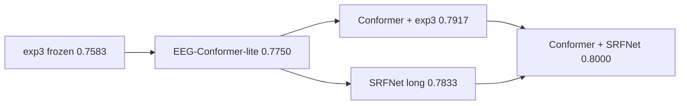
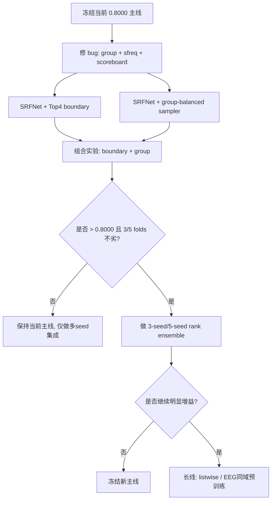

# bmedesign 继续提分深度审计报告

## 执行摘要

仓库是**可访问的**。我已经通过 entity["organization","GitHub","code hosting service"] 连接器成功读取到最新成绩总表、核心训练脚本、损失函数、Conformer/SRFNet 主线、group-aware smoke 脚本、bandpower/arena 支线代码和依赖文件，因此这不是“拿不到仓库”的问题，而是“当前主线已经换代，但训练目标、支线代码和实验治理还没完全跟上”的问题。fileciteturn61file0turn68file0turn70file0turn80file0

我对现状的核心判断很明确：你现在真正最强的路线已经不是早期的 exp3 双分支，而是 **subject-level Top-4 decoding** 口径下的 **Conformer + SRFNet rank ensemble**，当前总表给到 **BA=0.8000**；单模型中，**SRFNet long = 0.7833**、**EEG-Conformer-lite tuned = 0.7750**，而 **exp3 frozen = 0.7583**。同一份总表还明确写到：**固定阈值 NoTop4 只有 0.7812，而 Top-4 decoding 到了 0.8000，提升 +0.0188**；并且在最优集成里 **exp3 的最优权重已经降到 0.00**。这意味着你下一步最应该做的，不是继续围着阈值、AdaBN、DANN 或旧 exp3 小修小补，而是**继续把“排序”这条主线做深**。fileciteturn61file0

我最建议你立刻推进的事情有四件：

第一，把当前 SRFNet 的训练目标从“BCE + 成对排序”进一步改成**直接对齐 Top-4 的边界/列表式目标**。因为你当前评估本质上已经是“每个 subject 的 8 个 trial 里选 4 个”，这是标准的 top-k 排序问题，不再是普通二分类。NeuralSort、PiRank 和 differentiable top-k 这类工作都说明：当最终指标依赖排序或 Top-k 时，训练目标越接近排序本身，越能减少 surrogate gap。fileciteturn68file0turn70file0turn61file0 citeturn1search0turn1search1turn1search4

第二，把**DEP 组鲁棒性**当作主战场。当前总表显示 DEP BA 只有 **0.7500**，HC BA 是 **0.8250**，差距 **0.0750**；仓库里还专门有 DEP fold0 故障审计和 group-aware smoke 路线，说明你自己也已经定位到“最剩余的误差不是整体容量，而是 group robustness”。fileciteturn61file0turn63file0turn74file0

第三，先修掉几个会直接污染实验结论的代码问题，尤其是 **250Hz/128Hz 采样率不一致** 与 **group-aware 脚本中的实现 bug**。这些问题不一定拖累当前 0.8000 主线，但会直接让你对 bandpower/graph/group 方向得到“假阴性”。fileciteturn18file0turn39file0turn54file0turn56file0turn58file0turn64file0turn67file0

第四，把多 seed 的 **Conformer + SRFNet rank ensemble** 变成标准流程，而不是继续开 architecture zoo。因为仓库自己的结果链已经说明：真正持续给你涨分的是“更好的排序信号 + 更好的互补集成”，不是不断更换老方向。fileciteturn61file0turn73file0turn83file0

## 可访问性与当前主线

通过连接器成功读取多个关键文件这一事实本身，就已经说明仓库可以访问；但更重要的是，仓库内部现在**同时存在几份彼此冲突的“最终结论”**。`scripts/arena_finalize.py` 仍然把 frozen baseline 写成 0.7583，并给出“没有 challenger 超过 baseline”的结论；`scripts/conformer_finalize.py` 又把 tuned Conformer 提升到 0.7750 并建议 promote；而仓库里显式带日期的 `模型成绩汇总_2026-04-30.md` 则进一步把 **Conformer + SRFNet rank ensemble** 定为 **PRIMARY，BA=0.8000**。这说明你现在最大的流程风险之一，不是模型没涨，而是**实验知识已经分散到多代脚本里，source of truth 没统一**。fileciteturn37file0turn59file0turn61file0

在我看来，当前应当把 `模型成绩汇总_2026-04-30.md` 视为**最新的业务口径**，因为它明确写了“截至 2026-04-30”，而且把你从 exp3 → Conformer → SRFNet → rank ensemble 的整条演进链一次性串起来了。按照这份最新总表，你的主线不是“trial-level 阈值分类”，而是“subject-level 排序 + Top-4 结构化解码”。fileciteturn61file0

下表是我基于这份最新总表抽出的**当前可信天梯**。fileciteturn61file0

| 路线 | BA | 角色 |
|---|---:|---|
| Conformer + SRFNet rank ensemble | 0.8000 | 当前主提交 |
| Conformer + exp3 rank ensemble | 0.7917 | 备份 |
| SRFNet long | 0.7833 | 强单模型 |
| EEG-Conformer-lite tuned | 0.7750 | 强单模型 |
| exp3 frozen | 0.7583 | 历史稳健基线 |

这条演进链可以非常直观地画出来。分数全部来自仓库最新总表。fileciteturn61file0



另一个重要结论是：仓库最新总表已经把 **AdaBN、DANN、EA、DENS、Graph/STF、主线 contrastive** 基本都归到了 STOP、REJECT 或 DIAGNOSTIC。换句话说，这些方向现在最多适合做附录或答辩材料，不适合继续吃你的主算力预算。fileciteturn61file0

## 瓶颈定位

你现在最核心的瓶颈，不是“模型还不够深”，而是**训练目标与最终决策口径之间仍然存在错位**。仓库最新总表已经明确把任务表述成了“subject 内 8 个 trial 的相对排序 + Top-4 解码”，并且直接给出 Top-4 比固定阈值更强；但 `scripts/train_srfnet.py` 里的 SRFNet 主训练循环，仍然是 `BCEWithLogits` 加上 `pairwise_subject_ranking_loss` 和 `trial_consistency_loss`。`training/losses/ranking_loss.py` 的 ranking loss 实际上只是要求“正样本分数高于负样本分数”，并没有直接优化“第 4 名必须压过第 5 名”这个**真正决定 Top-4 成败的边界**。fileciteturn61file0turn68file0turn70file0

这个判断和外部方法论是完全一致的。EEG-Conformer 原始论文本身强调的是卷积提局部、自注意力抓全局依赖；而你的仓库结果也恰好证明，真正持续涨分的正是 Conformer/SRFNet 这类能提供更好**排序信号**的路线。另一方面，NeuralSort、PiRank 和 differentiable top-k classification 的共同核心，是把不可微的排序/Top-k 操作用连续松弛带回训练目标，使训练和最终排名指标更一致。对你这个“每个 subject 恰好选 4 个 positive”的任务，这类思路非常贴题。fileciteturn61file0 citeturn2search1turn1search0turn1search1turn1search4

第二个瓶颈是**worst-group robustness**。最新总表里，DEP BA 0.7500、HC BA 0.8250，差距 0.0750；而且仓库里还有专门的 DEP fold0 故障审计脚本和 group-aware smoke 脚本。换句话说，你已经把“错误集中在哪一群人/哪一折”定位得足够清楚了，下一步应该从“让主线更稳”而不是“再换一批 backbone”入手。fileciteturn61file0turn63file0turn74file0

第三个瓶颈是**工程干净度不够，导致你一些本来可能有价值的方向被错误判死刑**。最典型的就是：全仓主口径把原始采样率写成 **250Hz**、4 秒窗口就是 **1000 点**，但 arena feature 支线和 bandpower 支线里，有多处硬编码 **128Hz**。如果这些支线用错频率划带，那么它们成绩差，不一定是方法差，可能只是实现错了。fileciteturn18file0turn39file0turn54file0turn56file0turn58file0

## 最高优先级改进项

### 把训练目标直接对齐 Top-4

**严重级别：高。**

**证据。** 最新总表已经把主口径明确切换到 subject-level Top-4，而且 NoTop4 比 Top-4 低 0.0188；但当前 SRFNet 训练仍是 BCE + pairwise ranking + consistency。`pairwise_subject_ranking_loss` 只做“正大于负”的成对软间隔，没有直接约束 Top-4 边界。fileciteturn61file0turn68file0turn70file0

**为什么这会卡分。** 你最终提交时并不是看“某个 trial 是否超过固定阈值”，而是看“在同一个 subject 的 8 个 trial 里，谁排前 4”。这意味着真正重要的不是全局 calibration，而是**subject 内 rank4/rank5 的边界稳定性**。NeuralSort、PiRank、differentiable top-k 的价值正是在这里：把训练目标拉向真正的排名指标。citeturn1search0turn1search1turn1search4

**如何复验。** 不要一上来就引入外部库；先做一个**快速、低风险的边界损失** ablation。基线仍然用你现在最强的 `configs/srfnet_trial0007_best_e6e10.yaml`，只新增一个 `top4_boundary_loss`。跑法可以直接做成两组 5 折：

```bash
python scripts/train_srfnet.py --config configs/srfnet_trial0007_best_e6e10.yaml
python scripts/train_srfnet.py --config configs/srfnet_top4_boundary.yaml
```

然后对比 `top4_predictions_cv.csv` 的 mean BA、每折 BA，以及 DEP/HC BA。

**修复建议。** 在不引入新依赖的前提下，先上一个“第 4 个正样本 vs 第 5 个负样本”的边界损失；如果这条线有收益，再升级到可微排序/Top-k 松弛。

```python
# training/losses/top4_boundary.py
from __future__ import annotations
import torch
import torch.nn.functional as F

def top4_boundary_loss(
    trial_scores: torch.Tensor,
    trial_labels: torch.Tensor,
    subject_ids: list[str],
    *,
    tau: float = 0.2,
    margin: float = 0.0,
) -> torch.Tensor:
    losses = []
    seen = list(dict.fromkeys(subject_ids))
    for sid in seen:
        idx = [i for i, s in enumerate(subject_ids) if s == sid]
        if not idx:
            continue
        s = trial_scores[idx]
        y = trial_labels[idx] > 0.5
        pos = s[y]
        neg = s[~y]
        if pos.numel() == 0 or neg.numel() == 0:
            continue
        hardest_pos = pos.min()
        hardest_neg = neg.max()
        losses.append(F.softplus((hardest_neg - hardest_pos + margin) / tau))
    return torch.stack(losses).mean() if losses else trial_scores.new_tensor(0.0)
```

我的建议不是马上把 BCE 扔掉，而是先用：

`total_loss = ce + λ_rank * pairwise_rank + λ_cons * consistency + λ_top4 * boundary`

其中 `λ_top4` 先从 **0.05 / 0.1 / 0.2** 三档做 5 折。这样风险可控，而且最接近你的真实提交逻辑。

### 把 DEP gap 当成主战场，而不是继续开旧路线

**严重级别：高。**

**证据。** 最新总表写得非常直白：当前最优路线的 **DEP BA=0.7500，HC BA=0.8250**，差距 0.0750；同时还有 `dep_fold0_audit.py`、`g5_group_smoke.py`、`g5b_film_smoke.py` 这条 group-aware 试探路线。fileciteturn61file0turn63file0turn67file0turn74file0

**为什么这会卡分。** 你现在的总体 BA 已经到 0.8000 了，再靠全局平均改进去抬分，边际收益会越来越小；但 worst-group 还很弱，这反而是更现实的上升空间。更关键的是，仓库当前最优集成已经把 exp3 权重压到 0.00，说明“继续围着 exp3/AdaBN 打磨”很可能已经不是 ROI 最高的方向。fileciteturn61file0

**如何复验。** 我建议把下一轮实验切成三层，且都**不依赖 oracle group label 做最终推理**：

第一层，只做 **group-balanced sampler**，不改模型。  
第二层，在 SRFNet 上增加 **辅助 group head** 或 worst-group-aware monitor，但**推理时不输入 group**。  
第三层，只有当前两层都有效时，才尝试 FiLM 或显式 group-conditioned routing。

最实用的验收脚本是直接用现有 `top4_predictions_cv.csv` 做 group BA 统计：

```bash
python - <<'PY'
import pandas as pd
from sklearn.metrics import balanced_accuracy_score
df = pd.read_csv("outputs/your_run/top4_predictions_cv.csv")
for prefix in ["DEP", "HC"]:
    sub = df[df["subject_id"].astype(str).str.startswith(prefix)]
    print(prefix, balanced_accuracy_score(sub["y_true"], sub["y_pred"]))
PY
```

**修复建议。** 就“立即可用”而言，我更推荐你先推 **Group-Balanced Sampler + worst-group-aware model selection**，而不是直接把 true group 喂进模型。原因很简单：后者在公开/私有测试时未必拿得到 group metadata，而前者没有这类部署风险。

你可以把 promote 规则收紧成下面这样：

- 新候选 mean BA 必须 **> 0.8000**
- 至少 **3/5 folds** 不低于当前主线
- **DEP BA 不下降**
- **HC BA 下降不超过 0.01**

这和仓库里候选选择脚本已经在用的“至少 3/5 folds 不劣”逻辑是一致的，只是把基线从 0.7583 升级到了你现在的 0.8000 主线。fileciteturn41file0turn61file0

### 修掉 group-aware 路线里的实现 bug

**严重级别：高。**

这部分我单列出来，因为它会直接影响你是否能正确判断“group-aware 路线到底值不值得继续”。

**证据一。** `models/srfnet_group.py` 表面上把 group embedding 拼到了融合输入里，但实际又把输入 slice 回 `self.backbone.gate[0].in_features` 和 `self.backbone.residual_head[0].in_features`。这会让额外拼进去的 `g_emb` 在 gate/residual 里**根本没有被真正使用**。fileciteturn64file0

**证据二。** `scripts/g5b_film_smoke.py` 在 group breakdown 那里用的是 `gd["pred"]` 和 `sd["pred"]`，但前面 `predict_dataset_film` 写出的列是 `y_pred`。这个地方不是小瑕疵，而是会直接让 smoke 分析报错或读错列。fileciteturn67file0

**证据三。** `scripts/g5_group_smoke.py` 的 `GroupBalancedSampler` 先对 `idxs` 做了 `[:windows_per_trial * 5]` 截断，后面再判断 `if len(idxs) > windows_per_trial * 5` 就几乎永远不会成立；这会让“随机抽子集”的逻辑失效，只拿到靠前的固定片段。fileciteturn63file0

**如何复验。**

```bash
rg -n "pred\\]|y_pred|group_embed|gate\\(|residual_head\\(" models scripts
python scripts/g5_group_smoke.py --folds 0
python scripts/g5b_film_smoke.py --folds 0
```

**修复建议。**

先修 `g5_group_smoke.py` 的 sampler：

```diff
- idxs = self.subj_indices[s][:windows_per_trial * 5]
- if len(idxs) > windows_per_trial * 5:
-     idxs = self.rng.choice(idxs, windows_per_trial * 5, replace=False).tolist()
+ all_idxs = self.subj_indices[s]
+ limit = windows_per_trial * 5
+ if len(all_idxs) > limit:
+     idxs = self.rng.choice(all_idxs, limit, replace=False).tolist()
+ else:
+     idxs = list(all_idxs)
```

再修 `g5b_film_smoke.py` 的列名：

```diff
- ba = balanced_accuracy_score(gd["y_true"], gd["pred"])
+ ba = balanced_accuracy_score(gd["y_true"], gd["y_pred"])

- ba_s = balanced_accuracy_score(sd["y_true"], sd["pred"])
+ ba_s = balanced_accuracy_score(sd["y_true"], sd["y_pred"])
```

至于 `SRFNetGroup`，我的建议反而是**别修旧类，直接用 `SRFNetFiLM` 作为主分支**，因为 `srfnet_film.py` 的实现更干净，它本来就是 near-identity 初始化，适合做低风险 conditional modulation。fileciteturn66file0

### 修掉 250Hz/128Hz 不一致，再重新评估 bandpower/arena 支线

**严重级别：高（对 side-branch correctness 来说）；中高（对当前主线提分来说）。**

**证据。** 全仓主线把采样率写成 **250Hz**：`EEGNET/data/constants.py` 是 250，最新成绩总表也明确写了“采样率：250Hz，4s window -> n_times=1000”。但 arena feature 路线 `scripts/arena_screening_v2.py` 里硬编码 `SFREQ = 128.0`；bandpower 分支的 `BandPowerFeatureLayer`、`TimeBandPowerModel` 和 `exp9_bandpower_vote.yaml` 也都以 128Hz 为默认。也就是说，你在一些特征型支线上做 band indexing 时，很可能实际是在用**错误的频率分辨率**。fileciteturn18file0turn39file0turn54file0turn56file0turn58file0turn61file0

**为什么这会卡分。** 这不一定解释当前 0.8000 主线，因为当前最强主线主要靠 Conformer 与 SRFNet；但它会让你对 bandpower、LGGNet、DAMGCN、feature-model 这些支线得到“不公平的低分”，从而错过一个可能作为**弱学习器/互补学习器**的分支。

**如何复验。**

```bash
rg -n "128\\.0|SFREQ = 128|band_fs: 128" EEGNET models scripts configs
```

如果修完以后，你只需要重跑两件事就够了：  
其一，`exp6/7/8/9` bandpower 家族；  
其二，`arena_screening_v2.py` 里 feature 类型模型。  
我不建议它们再争“主模型”，但它们完全有机会在 rank ensemble 里变成小而稳的第三路信号。

**修复建议。**

```diff
diff --git a/scripts/arena_screening_v2.py b/scripts/arena_screening_v2.py
@@
-SFREQ = 128.0
+from EEGNET.data.constants import SFREQ as RAW_SFREQ
+SFREQ = float(RAW_SFREQ)
```

```diff
diff --git a/EEGNET/models/bandpower_layer.py b/EEGNET/models/bandpower_layer.py
@@
-    def __init__(self, fs: float = 128.0, ...)
+    def __init__(self, fs: float = 250.0, ...)
```

同时把所有 `band_fs: 128.0` 的 YAML 统一改成 `250.0`，或者更彻底一点，由模型从 `EEGNET.data.constants.SFREQ` 读取，不再在配置里分叉。

### 少做什么比多做什么更重要

**严重级别：中。**

**证据。** 仓库最新成绩总表已经把 AdaBN、DANN、EA、DENS、RobotFaces、Graph、STF、主线 contrastive 都给出了相对明确的结论：不是负收益，就是不稳定，要么只能做 supplementary。fileciteturn61file0

**建议。** 如果你的目标是“继续提分”，那接下来至少一周的 GPU 预算，我建议按下面的优先顺序排：

- **优先**：Top-4 对齐损失、DEP 稳健性、Conformer/SRFNet 多 seed  
- **次优**：250Hz 修正后的 bandpower/arena 作为互补弱学习器  
- **延后**：任何 AdaBN/DANN/EA/旧 exp3/Arena 大模型大网格  
- **最延后**：generic 外域预训练

如果将来比赛规则允许你重新碰外部预训练，那么也应该优先考虑**同域 EEG 数据**，而不是继续走 generic image/video 路线。FACED 是一个 123 名受试者、32 通道、正负情绪都较平衡的 EEG 情绪数据集；LibEER 也把 FACED 放进了统一 benchmark 里。也就是说，如果你真要再碰 transfer，应该是“EEG 域预训练”，不是“拿别的模态硬迁移”。citeturn0search0turn3search0

## 工程与评估修复

这里我给一个“当前状态 vs 推荐状态”的对照表。当前状态取自仓库最新总表、SRFNet 配置、training monitor 配置、requirements 和现有 smoke/test 脚本。fileciteturn61file0turn80file0turn82file0turn49file0turn50file0turn8file0turn9file0

| 维度 | 当前状态 | 推荐状态 |
|---|---|---|
| 主指标 | subject-level Top-4 BA | 保持不变 |
| 当前最强 | Conformer + SRFNet rank ensemble，BA=0.8000 | 仅在 >0.8000 且 ≥3/5 folds 不劣时 promote |
| 单模型 strongest | SRFNet 0.7833；Conformer 0.7750 | 继续围绕 SRFNet/Conformer 做 |
| 训练目标 | BCE + pairwise rank + consistency | BCE + boundary/listwise Top-4 |
| 组间稳健性 | DEP 0.7500；HC 0.8250 | 先把 gap 压到 <0.04 |
| 支线采样率 | 多处 128Hz 硬编码 | 全仓统一 250Hz 参数化 |
| 结果治理 | 多份 finalize 脚本结论冲突 | 一个 canonical leaderboard.json/csv |
| 测试 | 形状验证和监控模拟脚本为主 | pytest 回归 + top4/sfreq/group regression |
| CI | 未检到 workflow | PR CI + nightly smoke |
| 依赖治理 | requirements 只写最低版本，没有 lock | 加 lockfile、pip-audit、复现实验环境 |

这里还有两个工程问题，虽然它们本身不直接涨分，但会显著影响你“有没有真的提分”的判断。

其一，仓库很多定稿脚本都依赖 `outputs/...` 下的历史工件，而这些工件并没有全部提交进仓库。换句话说，我可以审计代码和仓库内总结，但无法仅靠干净 clone 从头复算全部历史结论。这个限制必须承认，否则容易把“脚本里写的数字”误当成“已由当前仓库状态可重建的数字”。fileciteturn37file0turn59file0turn83file0

其二，`training_monitor/tuning_profiles/SRFNET.yaml` 里主指标还是 `macro_f1`，而你当前主叙事已经全面转向 Top-4 BA。这不一定会把模型选错到离谱，但它意味着你的自动调参系统和你最终答辩/提交口径**没有完全对齐**。fileciteturn80file0turn61file0

## 路线图

我建议你把下一轮工作切成三个时间层级，并且每个阶段都设置清晰的 **stop / go** 条件。

### 短期

先冻结当前 **Conformer + SRFNet，BA=0.8000** 作为不可回退基线，然后完成三件小而硬的修复：  
一是加 `top4_boundary_loss`；  
二是修 group-aware 路线的 bug；  
三是把 128Hz 全部清理干净。fileciteturn61file0turn63file0turn64file0turn67file0turn39file0turn56file0

**预计工作量：** 1–3 天。  
**风险：** 低。  
**通过标准：** 单模型 SRFNet 至少碰到 **0.790+**，或者 DEP BA 明显抬升而 HC BA 基本不掉。

### 中期

做一轮真正对齐业务目标的 5 折实验矩阵：

- SRFNet baseline  
- SRFNet + Top-4 boundary loss  
- SRFNet + group-balanced sampler  
- SRFNet + Top-4 boundary loss + group-balanced sampler  
- Conformer/SRFNet 各 3 seeds 的 rank ensemble

这里的 promote 条件我建议固定：

1. mean BA > 0.8000  
2. 至少 3/5 folds 不低于当前主线  
3. DEP BA 不下降  
4. HC BA 下滑 ≤ 0.01

这一步如果只让我押一个最值得赌的组合，我会押：  
**SRFNet long + Top-4 boundary loss + group-balanced sampler + 3-seed ensemble**

**预计工作量：** 3–7 天。  
**风险：** 中。  
**预期收益：** 最现实，且最接近你当前结果结构。

### 长期

如果中期已经把单模型或小 ensemble 做到 0.803–0.810 左右，你再考虑两条更重的线：

一条是**更正式的 listwise / differentiable sorting 训练**，把 boundary loss 升级成真正的可微 Top-k；  
另一条是**同域 EEG 预训练**，优先 FACED 这类大规模 EEG 情绪数据，而不是 generic image/video 源。FACED 和 LibEER 的存在，给了这条线更合理的外部依据。citeturn0search0turn3search0

这一步才是高投入路线；如果中期还没有把 objective mismatch 和 DEP gap 修好，我不建议提前跳过去。

你可以把整个决策流画成这样：



## 自动化检查与配置示例

当前仓库能看到的测试，更像是**脚本式 smoke**，例如模型 shape 验证和 training monitor 的模拟脚本；但还没有形成会自动阻止回归的 CI。requirements 也只是最低版本约束，没有 lock。fileciteturn49file0turn50file0turn8file0turn9file0

我建议你至少补三类自动检查：

**第一类：核心正确性回归。**  
检查 Top-4 解码、sampling rate 一致性、group-aware 列名和 smoke 脚本。

**第二类：基础代码质量。**  
Ruff、pytest、pip-audit。

**第三类：实验治理。**  
要求每次 candidate run 都输出统一格式的 `canonical_leaderboard.csv/json`，并保留 `fold_metrics.csv`。

下面给一份足够你直接落地的最小配置。

```toml
# pyproject.toml
[tool.ruff]
line-length = 100
target-version = "py311"
exclude = ["outputs", "auto_tune_runs", ".venv"]

[tool.ruff.lint]
select = ["E", "F", "I", "UP", "B"]

[tool.pytest.ini_options]
testpaths = ["tests"]
python_files = ["test_*.py"]
addopts = "-q"
```

```python
# tests/test_sampling_rate_consistency.py
from EEGNET.data.constants import SFREQ
from EEGNET.models.bandpower_layer import BandPowerFeatureLayer

def test_global_sampling_rate_is_250():
    assert SFREQ == 250

def test_bandpower_layer_uses_global_sfreq():
    layer = BandPowerFeatureLayer(fs=SFREQ)
    assert layer.fs == SFREQ
```

```python
# tests/test_top4_decode.py
import pandas as pd
from scripts.train_srfnet import apply_subject_top4

def test_apply_subject_top4_always_selects_four():
    df = pd.DataFrame({
        "subject_id": ["S1"] * 8,
        "original_trial_id": list(range(1, 9)),
        "prob": [0.1, 0.9, 0.2, 0.8, 0.7, 0.3, 0.6, 0.4],
        "y_true": [0,1,0,1,1,0,1,0],
    })
    out = apply_subject_top4(df, score_col="prob")
    assert int(out["y_pred"].sum()) == 4
```

```yaml
# .github/workflows/ci.yml
name: ci

on:
  push:
  pull_request:

jobs:
  lint-test:
    runs-on: ubuntu-latest
    steps:
      - uses: actions/checkout@v4

      - uses: actions/setup-python@v5
        with:
          python-version: "3.11"

      - name: Install
        run: |
          python -m pip install --upgrade pip
          pip install -r EEGNET/requirements.txt
          pip install -r EEGNET+AdaBN+DANN/requirements.txt
          pip install pytest ruff pip-audit

      - name: Lint
        run: ruff check .

      - name: Unit tests
        run: pytest

      - name: Smoke model shapes
        run: python EEGNET/scripts/test_model_shapes.py

      - name: Dependency audit
        run: |
          pip-audit -r EEGNET/requirements.txt
          pip-audit -r EEGNET+AdaBN+DANN/requirements.txt
```

如果你还想把 tuning monitor 和当前业务目标对齐，我建议把 `training_monitor/tuning_profiles/SRFNET.yaml` 里的主指标从 `macro_f1` 改成 `balanced_accuracy`，并新增 group guardrails。仓库现有 tuning profile 已经有自动预算和参数搜索机制，说明你不缺调参框架，你缺的是**把框架对齐到现在真正的 winning metric**。fileciteturn80file0turn61file0

```yaml
metric:
  target_section: "original_trial/all:all"
  primary: balanced_accuracy
  secondary:
    - macro_f1
    - roc_auc

guardrails:
  require_non_decreasing:
    - dep_ba
  max_drop:
    hc_ba: 0.01
```

我最后给你的结论很明确：**接下来最值得你做的不是“再找一个新 backbone”，而是“把当前 winning pipeline 变得更对题、更稳、更少假阴性”**。按仓库现在的证据，最有希望继续提分的方向是：

**Top-4 对齐损失 → DEP 稳健训练 → 多 seed 的 Conformer/SRFNet rank ensemble。**

如果这三步做完，你还要继续往上冲，再考虑正式的 differentiable sorting / listwise 训练，或者在规则允许下换成同域 EEG 预训练。现在就切过去，反而大概率会让你绕远路。